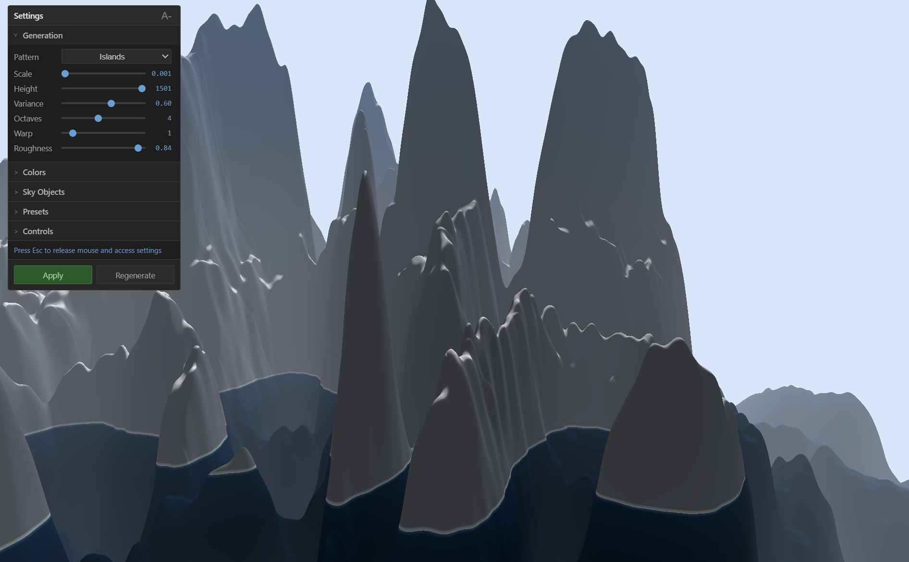

# Procedural Terrain Simulator

  <div align="center">
      <a href="https://procedural-terrain-simulator.pages.dev/" target="_blank">
          
      </a>
      <br>
      <a href="https://procedural-terrain-simulator.pages.dev/" target="_blank">
          <b>procedural-terrain-simulator.pages.dev</b>
      </a>
  </div>

<br>

A browser-based procedural terrain generator using Rust, WebAssembly, and WebGPU. Terrain heightmaps are computed on the GPU via WGSL compute shaders with real-time chunk streaming.

## Features
- GPU-computed terrain using WGSL compute shaders
- Procedural generation with simplex noise and domain warping
- Multiple terrain patterns
- Chunked world with streaming (33x33 chunk radius)
- Fly camera controls (WASD + mouse look)
- Height and slope-based terrain coloring
- Dynamic sky system with configurable stars, suns, and moons
- Multiple terrain presets
- Real-time settings panel with color customization
- Multiple color themes with real-time switching
- Atmospheric fog

## Requirements

- [Rust](https://rustup.rs/) (stable)
- [wasm-pack](https://rustwasm.github.io/wasm-pack/installer/)
- [Node.js](https://nodejs.org/) (v18+)
- A WebGPU-capable browser (see below)

## Browser Support

As of December 2025, **WebGPU is now supported across all major browsers** 

| Browser | Version | Platforms | Notes |
|---------|---------|-----------|-------|
| Chrome | 113+ | Windows, macOS, ChromeOS | Stable since April 2023 |
| Chrome | 121+ | Android 12+ | Qualcomm/ARM GPUs |
| Edge | 113+ | Windows, macOS | Stable since April 2023 |
| Firefox | 141+ | Windows | Enabled by default |
| Firefox | 145+ | macOS (ARM64) | Requires macOS Tahoe |
| Safari | 26+ | macOS, iOS, iPadOS, visionOS | Enabled by default |

### Safari Support Details

Safari 26 (shipping with macOS Tahoe, iOS 26, iPadOS 26, and visionOS 26) now includes WebGPU **enabled by default**. This is a major development - WebGPU maps directly to Metal on Apple platforms

Popular frameworks like Three.js, Babylon.js, Unity, and PlayCanvas all work in Safari 26. If you're on an older Safari version, you can enable WebGPU in Safari Technology Preview via **Develop > Feature Flags > WebGPU**.

### Platform Notes

- **Linux**: WebGPU support is still in progress for Firefox and Chrome
- **Intel Macs**: Firefox support is in progress (ARM64 Macs are supported)
- WebGPU requires a **secure context** (`localhost` or HTTPS)

## Setup

1. Install Rust target:
```bash
rustup target add wasm32-unknown-unknown
```

2. Install wasm-pack:
```bash
cargo install wasm-pack
```

3. Install npm dependencies:
```bash
npm install
```

## Development

Run the development server:
```bash
npm run dev
```

This will:
1. Build the WASM module (debug mode)
2. Start Vite dev server (defaults to http://localhost:5173)

## Production Build

```bash
npm run build
```

Output will be in the `dist/` folder, ready for deployment.

## Scripts

- `npm run wasm:dev` - build only the WASM bundle in debug mode.
- `npm run wasm:release` - build the optimized WASM bundle.
- `npm run preview` - serve the built assets in `dist/` for a local production check.

## Controls

| Key | Action |
|-----|--------|
| Click | Capture mouse |
| WASD / IJKL | Move forward/left/back/right |
| Mouse | Look around |
| Q/E or U/O | Rotate left/right |
| Scroll Wheel | Zoom in/out |
| Space | Move up |
| Shift | Move down |
| R | Regenerate terrain |
| Tab | Toggle settings panel |
| Esc | Release mouse |

## Settings Panel
- Non-linear sliders for terrain scale, warp strength, and roughness give finer control near low values.
- Preset buttons come from the Rust preset list; switching back to **Custom** restores your tweaked values.
- Color themes adjust only color inputs, while sky/weather presets adjust their respective sliders without touching unrelated fields.
- Apply regenerates terrain only when generation settings change; color-only tweaks update in place.
- The reset button (or `R`) keeps current parameters but randomizes the seed for a fresh layout.

## Weather System (Work in Progress)

> **Note:** This feature is currently under development and is disabled by default in the deployed version.

The particle system supports rain and snow effects with GPU-accelerated compute shaders.

**Available Weather Presets:**
- None (disabled)
- Light Rain / Heavy Rain / Drizzle
- Light Snow / Heavy Snow / Blizzard

**Customizable Parameters:**
- Particle density (affects count)
- Fall speed
- Wind direction (X/Z)
- Particle color

## Project Structure

```
src/
  lib.rs          # WASM entry point and JS bindings
  webgpu.rs       # WebGPU initialization
  camera.rs       # Fly camera
  terrain.rs      # Chunk management and rendering
  sky.rs          # Sky renderer (stars, suns, moons)
  particles.rs    # Particle system (weather) [WIP]
  presets.rs      # Terrain and sky presets
  input.rs        # Input handling
  utils.rs        # Utilities
shaders/
  terrain.wgsl    # Terrain compute + render shaders
  sky.wgsl        # Sky rendering shaders
  particles.wgsl  # Particle compute + render shaders [WIP]
web/
  index.html
  main.ts
  style.css
  constants.ts    # Configuration constants
  types.ts        # TypeScript type definitions
  utils.ts        # Utility functions
  public/         # Static assets (favicons, manifest)
assets/           # Screenshots and images
Cargo.toml
package.json
vite.config.ts
tsconfig.json
```

## Technical Details

- **Chunk Size**: 64x64 vertices per chunk
- **View Distance**: 33x33 chunks (~2km radius)
- **Terrain Generation**: Simplex noise with configurable octaves + domain warping
- **Chunk Pool**: 1089 pre-allocated chunks with LRU recycling
- **Sky Objects**: Up to 8000 stars, 200 celestial bodies (suns/moons combined)
- **Particles** (WIP): Up to 50,000 weather particles with GPU compute updates

## Architecture

- **Presets** (Rust): Complete terrain/sky/particle configurations that load all settings at once
- **Color Themes** (TypeScript): Quick color palette swaps for terrain and sky colors only
- **Weather Presets** (TypeScript): Quick weather effect configurations [WIP]

## Troubleshooting

- WebGPU requires a secure context: use `localhost` or HTTPS.
- On Windows, if a build fails with an access error under synced folders (e.g., OneDrive), rerun from an elevated shell or set `CARGO_TARGET_DIR` to a fully writable location.

## License

MIT
